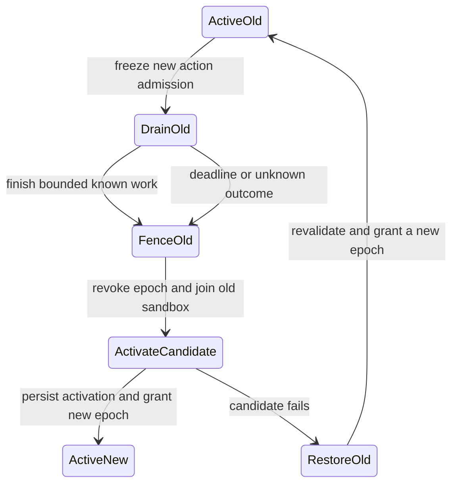

# ADR-008: Module containment, trust and safe activation

- **Status:** Proposed
- **Date:** 2026-09-30
- **Owners:** Housefold maintainers
- **Harness task:** D02
- **Implementation gate:** G01 also requires accepted ADR-007

## Context and threat model

Runtime currently runs non-root in a protected scratch HAOS app, with no host
ports, host networking, Docker API or general Supervisor API grant. Its Core
proxy credential authorizes more than approved reads. No module code is installed
or executed. Adding a child in the same container/UID would inherit access to
filesystem, process namespace and network; clearing environment alone does not
prove isolation from parent /proc, descriptors, signals, ptrace or memory. A
signature authenticates provenance, not behavior. Go native code is not a
capability sandbox, and separate processes/non-root are insufficient containment.

Assets: Supervisor/Core credential, state/household context, action authority,
Runtime availability, last healthy package, activation record and timer ownership.
Attackers/faults: malicious approved-source dependency or signed module, corrupt
archive/path traversal, compromised distribution/key, spoofed module identity,
resource exhaustion, crashes, stuck drain, stale action lease, power loss and
operator error. The gateway cannot fence actions sent directly to HA/devices by
a network-capable child. Therefore grant enforcement must include denying bypass
network/credential access, not merely checking JSON at the Runtime endpoint.

## HAOS containment options and recommendation

| Option | Enforcement and resource behavior | Feasibility under present baseline |
| --- | --- | --- |
| Plain same-UID child, clean env | Gateway checks well-behaved requests; cannot enforce file/process/network isolation or child memory limits. Container OOM may kill Runtime. | Simple but rejected for grant-enforced/action-capable modules, even if signed. Development execution would require a separate explicit trusted-code scope; not authorized here. |
| Narrow launcher using unprivileged user/mount/PID/network namespaces + seccomp + delegated cgroup | Empty child filesystem/process view and no network; only private inherited IPC; static module, no parent secrets. Kernel cgroup limits isolate memory/CPU/PIDs. | Preferred only if exact HAOS kernel/AppArmor allows required unprivileged namespaces and cgroup delegation. Present scratch image has no launcher and current non-root Runtime cannot assume setuid/mount/cgroup authority. Unverified, so execution remains disabled. |
| Separate Supervisor app/container per module slot | Supervisor/container namespaces, AppArmor and per-container limits can separate Runtime credential/process. Needs explicit network policy and stripped module-specific credentials to prevent HA/device bypass. | Credible fallback, but current Runtime cannot orchestrate containers without new management authority. Supervisor-supported resource/network constraints must be demonstrated; `hassio_api: false` does not prove module has no platform token. |
| Privileged Runtime/Docker socket/host launcher | Broad isolation controls with broad host authority; module failure can compromise host through launcher. | Rejected as a default; contradicts existing protected least-privilege foundation. No Docker API grant proposed. |
| WASM/interpreted plugin | Can provide a more limited execution surface with runtime metering. | Changes native Go process baseline/toolchain and feature semantics; not recommended without a separate architecture decision. |

Recommend fail-closed capability discovery and a narrowly audited launcher,
without adding Runtime privileges by inference. Prototype only in a separately
authorized disposable HAOS VM after design acceptance. If any namespace,
seccomp, filesystem or resource prerequisite is absent, report `containment
unsupported`; do not silently launch an ordinary child. If HAOS cannot support
this baseline, review a separate Supervisor-container design and needed local
orchestration authority. An accepted design still needs evidence before a first
module activation. G01 must be split so feasibility failures cannot enable launch.

### Required enforcement profile before execution

- Static native ELF for supported architecture (no interpreter/dynamic linker),
  verified digest, private immutable executable opened without symlink races.
  No arbitrary package installer, shell, compiler, interpreter or startup script.
- Child network namespace has no interfaces/routes to HA, Supervisor, LAN,
  internet or other modules; seccomp denies creating/connect/bind sockets as
  defense in depth. The already-connected private IPC descriptor is the sole
  communication path. Unix path/socket scope from ADR-007 must be adapted to an
  inherited socketpair if exposing a path would violate this containment.
- Child mount/PID views exclude Runtime filesystem, credentials, other modules,
  host devices and parent /proc. Read-only verified code/minimal runtime files,
  bounded ephemeral tmpfs; no shared persistent household directory. Capabilities
  dropped, no-new-privileges, no ptrace/process_vm, namespace escape, mounting,
  module loading, host device access or process signaling outside sandbox.
- Explicit env allowlist (locale/config references only), clean descriptor table
  except stdin/stdout/stderr policy and private IPC; no Supervisor token, proxy
  credential, cloud identity or Runtime management socket. Logging must be
  bounded and sanitized; arbitrary child stdout may contain data, not trusted
  structured metadata. Default discard stdout/stderr payload, record exit and
  coarse health only until an explicit retention policy exists.
- Go threads require mmap/futex/thread-clone and timer syscalls; seccomp must
  distinguish thread creation from child processes and have architecture-pinned
  syscall tests. The launcher itself is a security component requiring audit;
  do not claim a generic syscall allowlist without testing actual static Go.
- cgroup memory.max, pids.max and CPU quota enforced before exec, with Runtime
  outside child group; memory.high/pressure signals if supported. Initial review
  profile: 128 MiB memory, 64 tasks, 0.5 CPU, 16 MiB tmpfs, 16 MiB package,
  32 requests/s bounded IPC input; limits configurable only by maintainer policy.
  These are proposed budgets, not appliance measurements. rlimits alone do not
  adequately bound Go heap/process-tree CPU. No delegated cgroup means fail closed.
- Kill/join entire sandbox process tree with verified identity (pidfd or
  equivalent), resource cleanup and bounded stop even for an unresponsive child.
  Runtime health/ingestion must remain independent during child OOM/crash/flood.

Availability, UID maps, seccomp, cgroup v2 delegation and AppArmor permissions
must be recorded on exact supported HAOS/Core/Supervisor versions. Never infer
these from this developer Docker worker or a successful build. A containment
self-test must try parent token/environment/proc reads, host paths, signals,
network connects, descriptor theft, fork bomb, OOM and CPU flood before enabling
execution. No real credential should appear in attack fixture output.

## Package, provenance and approval

Proposed package is an immutable versioned manifest plus one static ELF and
license/provenance metadata, no archive executable hooks. Distribution never
executes discovered/downloaded code. Local operator approves source and signer,
exact digest/version, compatible contract, requested finite grants and limits.
Separate approval for source trust versus requested capabilities; updates that
expand scope or change signer need new approval. No default trusted catalogue
or unattended installer is established by this ADR.

```json
{"schema_version":1,"module_id":"synthetic-observer","version":"0.1.0","runtime_protocol":{"major":1,"min_minor":0,"max_minor":0},"platform":{"os":"linux","arch":"amd64","static":true},"artifact":{"path":"module","sha256":"64-hex-digest","bytes":1048576},"requested_grants":[{"kind":"state.read","entities":["sensor.housefold_test_0"],"attributes":[]}],"resources":{"memory_bytes":134217728,"pids":64,"cpu_millis_per_second":500,"tmpfs_bytes":16777216},"provenance":{"source_id":"approved-synthetic-source","revision":"pinned-source-revision","build_recipe":"pinned-build-recipe"},"signatures":[{"key_id":"approved-local-key","algorithm":"ed25519","signature":"detached-signature-reference"}]}
```

Review example values are placeholders, not a usable manifest/digest/signature.
Define signed bytes precisely before implementation: UTF-8 canonical manifest
without signatures using one documented canonicalization version, plus artifact
digest/length. Prefer signed immutable release metadata and reject duplicate JSON
keys/ambiguous canonicalization; compare a canonical binary representation option
if JSON canonicalization creates excessive implementation burden. Ed25519 keys
pinned by local operator, explicit rotation/revocation records; HTTPS is transport,
not provenance. Source can be approved offline/local. Require pinned build recipe
and dependency provenance/SBOM; reproducible build comparison is evidence, not a
substitute for signature or operator authorization. Verify at staging and launch.

Reject traversal, absolute paths, symlinks/hardlinks, extra/unlisted files,
unsupported architecture/dynamic ELF, size/digest mismatch, duplicate package
identity, rollback to disallowed/revoked version and untrusted/expired metadata.
Keep failures coarse; never execute to "test" unverified artifacts.

A new local persistent deployment store and installation UX are security
boundaries needing explicit acceptance. Proposed layout: immutable
`modules/<id>/versions/<digest>/`, separate staged candidate, operator-approved
policy record and minimal activation journal. No entity values, tokens or action
parameters in this store. Atomic rename on one filesystem plus file/directory
fsync where supported; corrupt/partial journal yields no action lease. Disk full
must preserve last healthy artifact and management. Runtime cannot self-approve
an update merely because its package is signed.

## Staging, health gates and quarantine

1. Validate approval, format, artifact, version, contract, finite grants and
   supported containment; stage immutably without touching active version.
2. Start candidate with observation-only grants and no action lease. Require
   handshake within 5 s, readiness within 30 s and 60 s stable healthy window,
   bounded resources/queues and no containment violations. These proposed
   numbers require test/appliance measurement.
3. Health is authenticated coarse liveness plus actual protocol responsiveness
   and Runtime-observed resource behavior, not arbitrary "ready" stdout.
   Cached fresh state and module readiness are separate dependencies.
4. Failed candidate is killed/joined, staged state quarantined and active healthy
   version retained. Keep a bounded local reason, digest/version and time, no
   raw module output or household state. Three crashes in ten minutes quarantine
   a version; exponential restart cap 30 s and operator review to clear quarantine.
5. Never garbage-collect active, last healthy or rollback-needed versions.
   Proposed retention: active + last healthy + one staged candidate; verify
   available space before staging. Key-revoked/known-unsafe old version cannot
   regain action authority just because it is the only saved artifact; report
   degraded/no active module and preserve Runtime recovery instead.

## Single-active fencing and draining

Runtime's action gateway maintains one active tuple per module:
`(boot_epoch, module_id, version_digest, activation_epoch, principal, grant_revision)`.
Activation epochs are random opaque values; server ownership is authoritative.
Every action validates the tuple at admission and at the final write gate. A
module cannot use a locally remembered expiry timestamp or old lease to regain
authority. Leases are revoked on health loss, grant revoke, process exit, Runtime
restart or activation change. Read-only candidate and draining old version never
hold concurrent action authority.



Recommended activation is deliberately sequential for the first implementation:
freeze old timers/triggers and new action admissions; drain bounded inflight work
(up to 5 s action deadline), invalidate old lease, stop/kill/join old sandbox,
then persist one new active record and issue candidate epoch. A small interruption
is safer than concurrent authority. No overlap even if candidate readiness was
proven with read-only scope. An old lease can never become valid after rollback.
If kill/join cannot be proven, candidate never receives action authority.

The write gate tracks requests in `admitted`, `sending`, `accepted/rejected` or
`unknown` state. Revocation cancels admitted unsent requests. Once sending may
have occurred, drain records an unknown outcome if no HA result arrives; cancel
cannot retract a device action. After uncertain actions, candidate/rollback must
not replay them. Reconcile permitted observations or request local operator
resolution. Already accepted HA actions may complete after old process is fenced;
this is not overlapping active module authority and must be visible as uncertainty,
not proof of physical cancellation. Gateway serialization guarantees no two
versions submit simultaneously; it cannot undo external device work.

### Timers, state and Runtime restart

Timer scheduling belongs to the active module epoch, with Runtime checking that
epoch before admitting any resulting action. Stop old triggers/timers at drain;
queued timer work from old epoch is rejected even if it runs late. No durable
catch-up/replay timers in the first contract. Candidate rehydrates only its
permitted fresh state snapshot; it cannot assume old module's transient variables
or historical events. State migration/persistent timers need a later retention
and execution contract.

On Runtime restart all prior boot/activation epochs are invalid. Verify journal,
approval/digests, supported containment and grants before starting modules.
Orphan detection must identify and kill/join previous sandboxes before any new
action lease; if process-tree/ownership state is uncertain, remain observation-only
and require local recovery. Rebuild fresh HA state first for state-dependent
modules. Old action requests/outcomes across a restart are unknown by default;
minimal activation journal is not a durable exactly-once action ledger.
Power loss during journal rename/fsync must recover at most one chosen version,
never both. Test every persistence boundary and corrupted/disk-full state.

## Runtime recovery is separate

Supervisor owns Runtime start/stop/watchdog and Runtime app updates; Runtime
cannot grant modules Supervisor/Docker/Core credentials to implement recovery.
Module installation/activation policy cannot replace Runtime's own binary,
change protected mode or silently upgrade app privileges. Last healthy module
retention does not prove Supervisor supports retaining a previous Runtime image.
Runtime self-update/rollback/unattended downloads remain separate unresolved
approval and HAOS validation work. Local Supervisor/host-console recovery stays
available with every module disabled and no Bridge/VPS/internet.

## Implementation slices and adversarial acceptance

After explicit acceptance: first a HAOS capability/containment prototype with
synthetic static binaries, then bounded launcher/resource policy, offline package
verification without execution, staged observation-only startup, finally fake-HA
action fencing/drain/journal fault tests. Each slice must prove failure behavior
before the next; absence of any prerequisite blocks execution, not just a warning.

Required tests: attempted parent token/proc/file/env/descriptor/network access;
PID reuse/kill races; resource pressure isolated from Runtime; dishonest health,
IPC flood/stopped reader; malicious archives/keys/signatures/scope expansion;
disk-full/crash at every stage; old lease after revoke/rollback/restart; two
candidates racing activation; hung drain/unkillable old worker; response lost
following HA send, delayed old timer and uncertain action during rollback. Verify
zero duplicate sends and exactly one gateway-authorized action epoch, with real
containment tests on supported HAOS distinct from mocked process tests.

## Decision requested and remaining gates

Accept fail-closed containment requirements and staged sequential activation,
then fund/authorize a disposable HAOS feasibility prototype. Select alternate
Supervisor-managed containers only with concrete resource/network/orchestration
permission evidence. Approve installation store, signer/source policy, finite
grants, resource profile and local activation UX separately as concrete policy.
D02 completion is a proposal, not installation/trust/HA action authority. G01 stays
gated; no same-UID fallback or runtime privilege expansion may bypass it.
