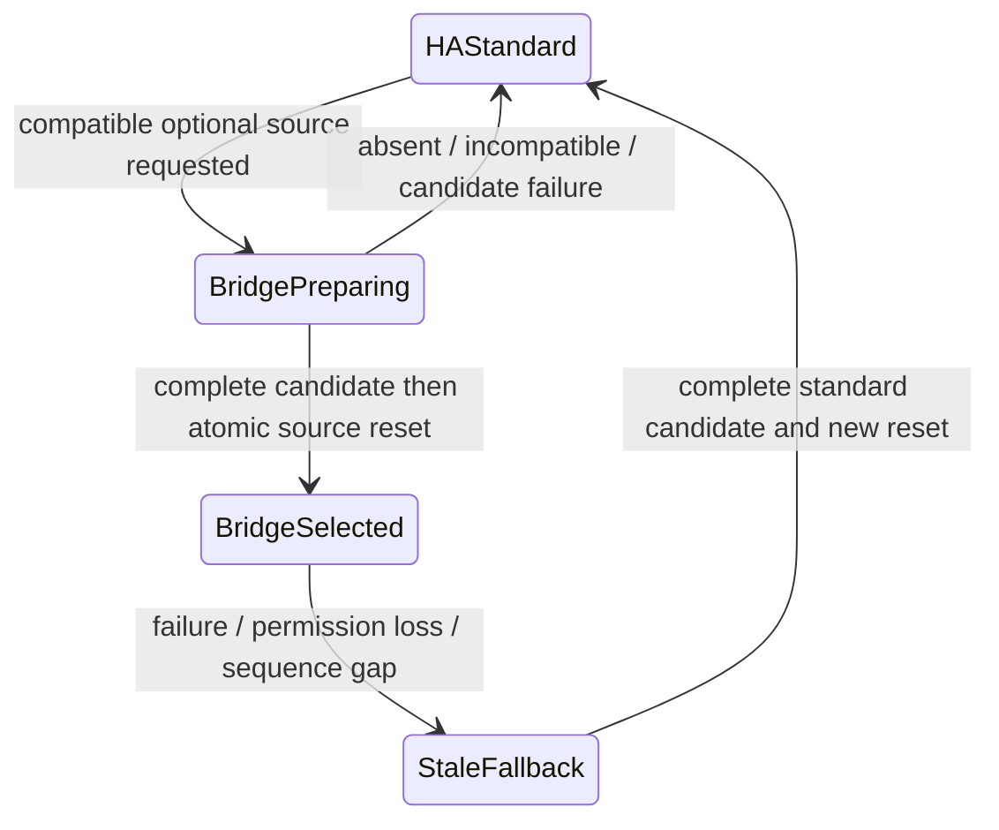

# ADR-009: Optional Bridge compatibility and fallback

- **Status:** Proposed
- **Date:** 2026-09-30
- **Owners:** Housefold maintainers
- **Harness task:** D03
- **Implementation gate:** G02 requires explicit acceptance of this ADR

## Context and boundaries

Runtime boots and ingests state over the Supervisor Core WebSocket proxy without
Bridge, modules, internet or cloud. Bridge is a separate Python integration in
Home Assistant Core, owned by a separate repository; this Runtime repo contains
only a future adapter and protocol fixtures. Bridge cannot own automation rules,
competing raw device truth or Runtime recovery. No Python integration or Bridge
adapter is implemented here. Current approved HA operations remain ADR-003's
standard read-only commands until this proposal is accepted.

Recommend discovery enrichment as the first optional capability; keep the
standard HA state path authoritative by default. Bridge state streaming can be
selected only after explicit compatible capability and synchronization evidence.
Actions remain ADR-007/008 gated and are not granted through Bridge by D03.

## Cross-container topology and authentication options

| Transport | Authentication/topology implications | Recommendation |
| --- | --- | --- |
| Custom versioned commands on existing HA Core WebSocket | Python integration registers commands; Runtime reaches Core through existing Supervisor proxy. HA authenticates the same private Runtime connection; no shared Unix path or new network listener. Integration must enforce HA permission/visible-data rules per command. | Preferred. Reuses local proxy recovery/credential provisioning while adding an explicitly reviewed command namespace. |
| Separate Bridge HTTPS/WebSocket listener | Needs routable Core-to-app endpoint, certificate trust, distinct provisioning/rotation/revocation and firewall policy; do not assume TLS alone authorizes. | Reserve if Core custom commands cannot meet bounds/ordering. Requires another credential/network ADR before implementation. |
| Bridge-initiated authenticated connection to Runtime | Requires Runtime listener/credential/session identity, discovery and source allowlist; ingress user identity cannot authenticate integration callbacks. | Defer; adds a new control/data surface absent from current baseline. |
| Unix socket | Requires shared filesystem namespace/mount permissions across Core/app containers. | Rejected default; no such shared namespace is assumed or requested. |

Use the current local `ws://supervisor/core/websocket` proxy only under its HAOS
trust boundary, not arbitrary remote plaintext connections. Remote Core TLS and
identity require separate approved topology. Never send Supervisor token to a
module, new remote endpoint or logs. Runtime authenticates Core normally; custom
command authorization runs inside Core. Do not add Supervisor API or Docker
access. A denied custom command is a capability failure, not a reason to ask for
an admin token or broaden Runtime app privileges.

The integration must apply HA user permissions/visibility to registry and state
results, bound requests/output and exclude context/user identities by default.
Core proxy may have broad visibility; Runtime must still enforce downstream
consumer grants from ADR-007. Bridge enrichment is private until an approved
consumer scope projects it. Source allowlists/authentication prevent an arbitrary
network peer from claiming to be HA or swapping discovery identities.

## Version and capability negotiation

Use a separate private Core WebSocket for Bridge negotiation/enrichment so a
missing command or faulty optional adapter does not interrupt the authoritative
standard state session. On connect authenticate, then send bounded hello with
supported Bridge major/minor and required features. Maximum handshake 5 s;
rejection/unknown-command/incompatible major records optional capability absent
without changing Runtime process health or default fresh state.

```json
{"id":10,"type":"housefold_bridge/hello","versions":[{"major":1,"min_minor":0,"max_minor":0}],"required_features":[],"requested_capabilities":["registry_v1","services_v1","ordered_state_v1"]}
```

```json
{"id":10,"type":"result","success":true,"result":{"protocol":{"major":1,"minor":0},"bridge_version":"0.1.0","core_version":"pinned-supported-version","bridge_epoch":"opaque-bridge-boot","capabilities":["registry_v1","services_v1"],"limits":{"frame_bytes":1048576,"snapshot_bytes":67108864,"event_bytes":8388608,"events":4096}}}
```

Capability absence means unsupported, not successful empty discovery. Required
feature absence/major mismatch is explicit incompatible state. Ignore unknown
optional capabilities/fields; do not interpret unknown state/action types.
Capabilities are versioned with semantic meaning, not inferred from integration
version strings. Exact Core/integration compatibility is tested and documented
in both repos. Minor additions are optional and bounded; changes to identity,
permission or sequencing need a major or explicit new capability. No Bridge
installation is attempted by Runtime when hello fails.

## Discovery enrichment (first recommended slice)

`registry_v1` returns source-qualified entity/device/area relationships, stable
provider IDs where HA actually supplies them, optional metadata and registry
revision. Preserve missing/permission-redacted/unsupported distinctly. An HA
entity ID or display name is not a universal stable physical-device identity.
Removed/renamed records are explicit; inference never rewrites HA registry truth.
`services_v1` returns permitted HA service/target/parameter descriptions; it
confers no execution grant. Unknown capability stays representable.

```json
{"id":11,"type":"housefold_bridge/registry_snapshot","scope":{"entities":["sensor.housefold_test_0"],"include":["entity","device_ref","area_ref"]},"max_bytes":1048576}
```

```json
{"id":11,"type":"result","success":true,"result":{"bridge_epoch":"opaque-bridge-boot","registry_revision":1,"complete":true,"entities":[{"source":{"provider":"ha","entity_id":"sensor.housefold_test_0"},"device_ref":null,"area_ref":null}],"missing":[]}}
```

Scope is finite and must fit Runtime's approved downstream discovery grants.
Initial review limit: one MiB/request and 16 MiB total private registry view,
maximum 65,536 records, staged bounded chunks for larger permitted views and
explicit too-large/partial error. No truncated response is called complete.
Replacement of registry metadata is atomic; disconnect marks registry stale,
separately from HA state freshness. Enrichment failure leaves standard state
operation intact; modules depending on enrichment report degraded capability.
Typed binding requirements remain ADR-007's future tooling tasks.

## Optional authoritative state capability

`ordered_state_v1` is disabled by default and requires verified server semantics
before preference. It supplies normalized entity payloads compatible with the
private model, an integration boot epoch, monotonically contiguous delivery
sequence and an explicit complete snapshot barrier. The Python integration must
subscribe first, stage a complete scoped snapshot at a defined event-loop gate,
return its barrier and only deliver subsequent sequences; buffering bounded by
64 MiB normalized snapshot plus 8 MiB/4,096 events. Its own overflow/callback
failure invalidates epoch/stream rather than pretending continuity. Chunked
snapshot has begin/count/bytes, indexed chunks and end; receiver never publishes
partial data. Native Core omission outside the integration's observations still
cannot be detected merely by adding Bridge sequence numbers.

```json
{"id":12,"type":"housefold_bridge/state_subscribe","capability":"ordered_state_v1","scope":{"provider":"ha","all_visible":true}}
```

The `all_visible` flag requests only records visible to this authenticated Runtime
Core identity, within ADR-003's approved private visibility. It is not a module
wildcard grant. The integration enforces that identity's HA visibility and the
accepted custom-command permission. Module streams are projected separately and
never receive this whole private view. This example becomes an allowed command
only after explicit acceptance; current Runtime never sends it.

State data includes HA current state/attributes/last_changed/last_updated, source
ID, Bridge epoch/sequence and barrier. Context/user/prior history is excluded.
Validate identity, timestamps, depth/normalized byte bounds, duplicate IDs,
sequence gaps/regression, epoch changes and failed reset end before publication.
A claimed sequencing capability without version-pinned tests cannot strengthen
freshness beyond ADR-003; prefer the standard adapter until proven.

## One source, atomic switching and fallback

Runtime has a single selected-source owner and publication gate. Candidate
adapters cannot call publish/applyLive directly without their current source
selection epoch. State sequences from Bridge and ordinary HA are never merged;
timestamps cannot prove equivalence or fill a gap between transports.



While Bridge candidate builds, the uninterrupted standard source stays selected
and can remain fresh. At switch commit, serialize validation with the source gate,
revoke standard live-writer epoch, publish complete Bridge candidate as a new
Runtime generation at revision zero, notify authoritative reset, then stop/join
old adapter. Race-late old events are rejected by epoch; only the selected source
can advance revision. If candidate becomes discontinuous before commit, abort it
and leave standard source unchanged. A source switch never keeps the same
generation or silently changes the meaning of freshness.

On selected Bridge failure/denial/overflow/gap, immediately mark published state
stale, fence Bridge writes, cancel/join optional source and synchronize via the
existing HA subscription/snapshot/replay path. Complete fallback increments
Runtime generation and emits reset. No stale in-place repair or "last event wins"
merge. A simultaneously prepared fallback may reduce outage only if its own
continuity and complete-candidate barrier are proven; never use a stale standby
snapshot as fresh. Core outage may affect both paths; process health/recovery
remains local and independent.

Enrichment-only failure does not mark standard state stale because it is not
the selected state source. Failure of Bridge does not repeatedly restart Runtime
or Core, auto-install integrations or loop through alternative credentials.
Every source selection is local explicitly approved configuration, not a network
message deciding authority.

## Heartbeat, retry and degradation

Use Core WebSocket ping/pong plus capability heartbeat when selected Bridge
promises sequence continuity. Proposed ping 20 s/pong 10 s; hello 5 s, discovery
request 10 s, full state sync 30 s. Heartbeat carries only Bridge epoch/current
sequence/capability status. Changed epoch or missed/invalid sequence makes selected
state stale; liveness alone never establishes fresh snapshot.

Retry optional negotiation at 1,2,4,8,16,30 s cap with bounded jitter after failure;
reset only after compatible successful capability synchronization. One optional
connection/retry worker; cancellations must join before process shutdown deadline.
After selected-source failure, pin standard state for at least 60 s before a
new explicitly configured Bridge preference attempt to avoid flapping. Prefer
maintainer-configured enrichment-only mode initially; timers are proposed worker
budgets requiring supported HAOS measurements.

Status can add only coarse optional capability/source labels under a later
reviewed status contract; no registry/entity data, integration secrets, arbitrary
error text or plugin installation suggestions derived from untrusted responses.
Current ingress page is unchanged by this proposal.

## Separate repository and migration

1. Accept topology, command permissions, finite schemas and compatibility matrix.
2. Python integration repo implements bounded hello/discovery fixtures and
   version-pinned Core tests, installation through an explicitly reviewed operator
   workflow; Runtime does not fetch/install Python code.
3. G02 splits into optional negotiation/enrichment adapter, permission/bounds and
   health/degradation tests. Prove boot/operation with unknown command and Core
   without integration before adding any selected-source state path.
4. Coordinate `ordered_state_v1` barrier/sequence server evidence across repos;
   only then implement source fencing/atomic reset/fallback and HAOS fault matrix.
5. Record supported versions and downgrade/disable procedure; removal restores
   standard state path without losing Runtime local management.

No Bridge auto-enable, public endpoint, action authority, discovery generator or
Python module belongs in this proposal's implementation commit.

## Required acceptance/adversarial tests

- Core without Bridge, incompatible major, missing feature, custom-command denial,
  unsupported Core version, dishonest limits and handshake timeout: healthy standard
  source remains available, no bootstrap dependency or credential escalation.
- Private visible-data permissions, finite discovery projection, raw context/user
  omission, malformed/deep/oversized registry/chunks and names/rename/removal.
- Epoch/sequence gaps/regressions/duplicate chunks, buffer overflow, callback loss,
  selected Bridge loss while standard is unavailable; stale retention until full
  successful fallback, no mixed/partial generation.
- Switch racing live update/disconnect/old callback; only current epoch writes,
  generation/reset at revision zero; candidate failure leaves standard unchanged.
- Cross-container proxy auth/actual topology, no assumed Unix mounts, lost pongs,
  cancel/retry flapping and bounded worker joins; no secret or entity data in logs.
- Both repos' old/new minor fixtures, supported HAOS/Core matrix; remove integration
  and disable WAN while Runtime continues local health/status/recovery.

## Decision requested

Accept enrichment-first custom Core commands and the one-source switching/fallback
rules. Review exact schema/permissions and require integration evidence before
state-source preference. G02 remains gated while this ADR is Proposed. Bridge
never becomes a required component for Runtime boot, state ingestion or recovery.
